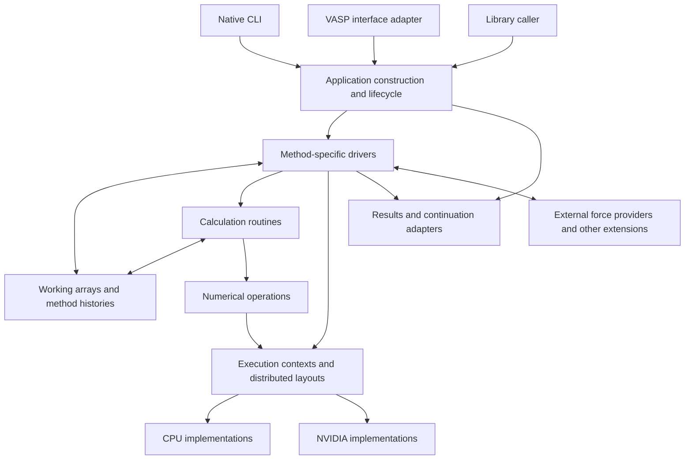

# Exvasperated: overarching design draft

**Draft 0.2 — 2026-09-25.** This proposal draws on the
[core reading](../research/core-design-study.md),
[broad reference campaign](../research/reference-campaign/README.md) and
[initial source studies](../research/first-pass/README.md). The engine is not yet
implemented. Each calculation subsystem still needs a focused study before its
detailed design and implementation.

The draft covers component interfaces, data types, memory, calculation history
and testing. Linux is the primary development platform. Deployment, storage and
implementation languages remain open. Numerical libraries will be tested
alongside our own implementations before adoption.

## What the program is

Exvasperated runs calculations of electronic structure, atomic motion and related
properties. It is both a command-line application and an embeddable library.
The researcher chooses a physical model, how to represent it numerically, and a
procedure to run. The program prepares the arrays and operators, runs the
procedure on CPU/NVIDIA resources, then returns results, a reason for stopping
and any requested data for continuing later.

A **method driver** is the loop that coordinates a particular calculation.
An SCF driver repeats electronic updates until its stopping rule is met. A
molecular-dynamics driver advances the integrator through force evaluations and
updates. A response driver coordinates its coupled solve. These drivers call
routines through their public interfaces.

The application core reads inputs, prepares those drivers and their resources,
handles startup and shutdown, and delivers outputs. Several coupled calculations
can run within this structure. Not every procedure is a ground-state solve or an
ionic loop. Interpreting experiments and suggesting calculations remain separate
possible capabilities.

## Reading guide

| Document | Design content |
| --- | --- |
| [Core structure and memory](core-structure.md) | Component interfaces, data types, buffer ownership, layouts, resource limits and storage operations |
| [Specifications and implementations](specifications-and-implementations.md) | Operation specifications, competing implementations, independent test references and teeth tests |
| [Calculation model and composition](calculation-model.md) | Calculation data, setup, updates, driver calls and the 15 groups of routines |
| [Positions, iterations and time](calculation-time.md) | What moves, nested electronic/ionic loops, integrator stages and execution ordering |
| [Execution and lifecycle](execution.md) | Application states, CPU/NVIDIA placement, MPI, asynchronous memory, stopping, errors and cleanup |
| [Results and continuation](results-and-continuation.md) | What results mean, saving checkpoints, resume/import/migration and failure cases |
| [Append-only calculation history](calculation-history.md) | Saved entries, shared array blocks, restoring and branching, save confirmation and a small protocol model |
| [Interfaces and compatibility](interfaces-and-compatibility.md) | CLI/library boundaries, configuration, VASP profiles, downstream tools, extensions and packaging |
| [Verification and design completion](verification.md) | Difficult test cases, protocol models, correctness checks, implementation order and open decisions |

## Proposed architecture

1. **One engine, several entry points.** Native input, VASP compatibility and
   library calls prepare the same calculation data and drivers. Adapters handle
   differences in input and output formats.
2. **Each driver controls its calculation.** It defines iteration, convergence,
   coupling and adaptation, including how to use history and select branches.
   The app handles startup, running and shutdown.
3. **Keep data with the routines that update it.** An SCF session stores its
   iterates and mixer history; an integrator stores its positions, momenta and
   stage. Basis/grid data structures keep their dependent maps and operators.
   Buffer owners control release through the execution adapter. These are
   explicit values passed between operations, not mutable globals.
4. **Use data types and constructors to prevent mismatches.** A density belongs
   to a particular grid; orbitals belong to a basis; a finite-field calculation
   may need branch information. Store those relationships with the data and
   check them when constructing or using it.
5. **Distinguish changing a calculation from moving its data.** Basis projection,
   mixer reset and atomic-dataset replacement need rules specific to the method.
   Redistributing unchanged array entries is an execution operation.
6. **Be precise about continuation.** Restoring a saved point recovers its values
   and retained history. Continuing appends a new branch. Initialization from
   selected prior results and conversion to another representation are separate
   operations. Missing required history is an error on native resume. Identical
   future numerical execution is not promised.
7. **Keep resources alive until work finishes.** Pending GPU/MPI operations retain
   the buffers they use. Writers read stable data. Returning from a library call
   does not necessarily mean the GPU has finished.
8. **Test compatibility through real workflows.** Versioned input/output rules,
   downstream tools, continuation and process behavior define the target. Broad
   VASP parity remains the ambition; claims cover only demonstrated combinations.
9. **Components interact through interfaces.** Calculation modules, execution,
   storage and writers expose operations and selected data views. Callers do not
   reach into their private fields or storage.
10. **Design memory use alongside control flow.** Specify placement, indexing,
    access, scratch space and completion for each operation. Bound resources and
    define what happens at capacity. Measure the cost of layouts and transfers.
11. **Compare implementations against the same specification and tests.** Existing
    libraries, our routines and generated kernels must get the required results
    and meet resource requirements, including conversion and integration costs.

## Architecture

The arrows show who calls whom and where data is used. Drivers use ordinary
function calls and loops. Execution can use streams, events and bounded queues;
we do not need a universal graph language to express every calculation.

## Proposed dependency organization

Stack selection remains open; see the
[stack discussion](../research/stack-and-symbolic-computation.md). The names below
suggest how to divide the code. They do not choose a language, foreign interface
or storage engine. Our code uses data and operations, with no OOP.

Start with a small workspace; module boundaries matter more than package count.
The following are dependency boundaries, not a requirement to create all packages
before the first calculation exists.

| Module | Responsible for | May depend on |
| --- | --- | --- |
| `exv-domain` | Geometry, species/data descriptions, units and representation identities | Small data/math support |
| `exv-execution` | CPU/device allocations, layouts, MPI/context ownership, completion | Domain shape/index descriptions; selected numerical/FFI adapters |
| Calculation modules | Physical representations, operators, numerical methods and histories | Domain and execution interfaces |
| `exv-methods` | Concrete calculation procedures and their composition | Calculation modules |
| `exv-io` | Native data encoding, checkpoint storage and result writers | Domain and method-owned serialization views |
| `exv-compat-vasp` | Versioned input/output/continuation translations | Domain/method construction and IO interfaces |
| `exv-app` | Preparation, process lifecycle, command dispatch and outcome mapping | The above |

Calculation modules define the data passed to their encoders. Writers use those
views, so a solver need not depend on a particular file container or a global
serializer registry. Progress and stop interfaces can live beside driver APIs to
avoid dependency cycles. The CLI remains a thin layer over `exv-app`.

Wrap foreign libraries and device launches in adapters for specific operations.
The adapter must handle the library's numerical behavior and keep buffers alive
through asynchronous work; its function signature alone cannot ensure either.
Choose a runtime backend per substantial operation, keeping dispatch out of
scalar arithmetic loops.

Hand buffer ownership from one operation to the next while the bytes stay in
place. Pending work retains that ownership until it finishes. Introduce shared
access where the calculation needs it; no lease-management service is proposed.

## What is deliberately left open

The draft contains HDF5/immutable-generation storage sketches for investigation,
a synchronous method API with internal asynchronous execution, and MPI calls on
the initializing thread as an initial distributed execution proposal. Storage
engine, metadata organization and deployment remain open. Reuse mature database
and storage operations where appropriate before constructing their equivalents.
The [core storage boundary](core-structure.md#5-storage-responsibilities-without-premature-deployment-choices)
states the needed operations without selecting their implementation.
The history proposal uses generations to store arrays referenced by an append-only
record of the calculation. Restoring recorded values and history is the commitment;
entry schemas and recording frequency still need design.

No FFT/eigensolver library or CUDA compiler has been selected. cuda-oxide, cudarc,
CubeCL and native library paths remain candidates with different roles. CPU and
NVIDIA are alpha requirements; AMD remains a second wave. Develop primarily on
Linux with macOS as a secondary port of the same core. This does not presume a
deployment environment; exact OS/architecture and storage support remain open.

The broad survey cannot settle basis/grid details, history-reset rules, default
tolerances, convergence policies or algorithm choices. Those require focused
studies. This draft identifies which components must implement them.

## Improvement goals to measure

The intended advantages are reliable calculations, faithful continuation,
understandable inputs/outcomes, competitive CPU/NVIDIA execution and low-friction
adoption. Candidate improvements include clearer effective settings, fewer
accidental host/device transfers, explicit representation updates, independently
tested derivative paths and more useful numerical failure reports.

Measure improvements on matched workloads and physical quantities. Fewer
iterations, faster kernels, smaller residuals or more input tags do not by
themselves establish superiority. The design preserves room for researchers to
choose different valid procedures, including different physical preparations and
metastable branches.
