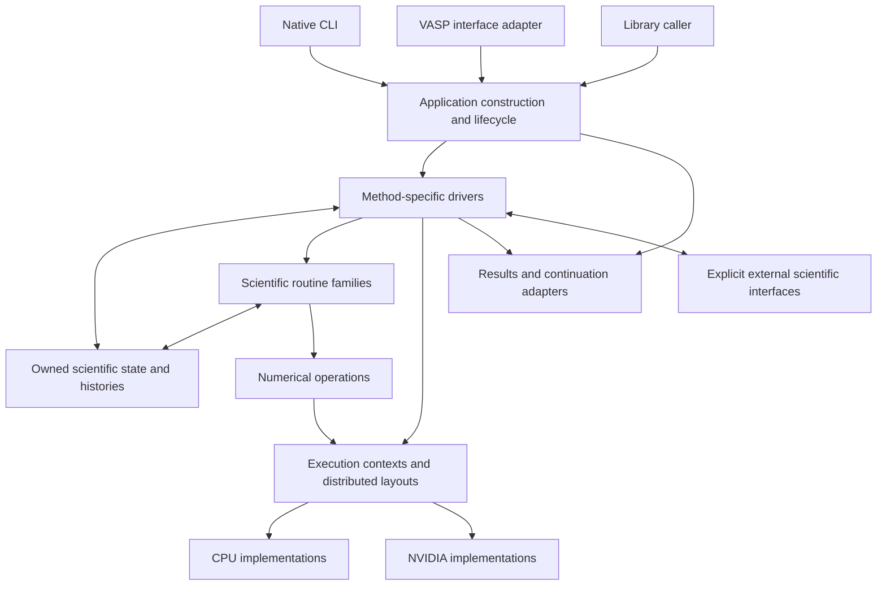

# Exvasperated: overarching design draft

**Draft 0.2 — 2026-09-25.** Proposed application architecture grounded in a
[focused reading pass](../research/core-design-study.md), the
[broad reference campaign](../research/reference-campaign/README.md), and the
[initial source studies](../research/first-pass/README.md). This is a design for
review, not an implemented engine or a frozen specification. The user's current
request authorizes this overarching design and a thoroughly considered app core.
Every scientific subsystem still requires its focused expedition before detailed
design and implementation.

This revision incorporates interface-only composition, algebraic data types,
resident ownership, memory layout, teeth tests and the bounded development/review
cycle. Linux is the primary development direction; deployment, storage technology
and implementation languages remain open. Numerical libraries are candidates to
test, alongside our own implementations.

## What the program is

Exvasperated is a scientific calculation application and an embeddable library.
A researcher specifies a physical model, a numerical representation and a
calculation procedure. The program constructs the corresponding scientific
objects, runs the procedure on CPU/NVIDIA resources, and returns quantities,
method outcomes and continuation state.

The scientific procedure is implemented by a **method-specific driver**. An
SCF solver owns its iteration; a molecular-dynamics method owns its integration
stages; a response method owns its coupled solve. The application core manages
inputs, construction, resource ownership, process lifecycle, outputs and external
interfaces. Scientific drivers compose these routines through domain APIs.

This structure also accommodates several coupled physical subsystems. It does
not assume that every calculation reduces to finding a ground-state density or
that every evolution is an ionic loop. Experiment interpretation and suggestions
remain a separate possible product.

## Reading guide

| Document | Design content |
| --- | --- |
| [Core structure and memory](core-structure.md) | Component interfaces, algebraic data, resident ownership, layouts, resource bounds and open storage responsibilities |
| [Specifications and implementations](specifications-and-implementations.md) | Scientific specs, implementation contests, independent oracles, teeth tests and automated work |
| [Calculation model and composition](calculation-model.md) | Domain objects, construction, ownership, state changes, driver composition and the 15 scientific families |
| [Execution and lifecycle](execution.md) | Application states, CPU/NVIDIA placement, MPI, asynchronous memory, stopping, errors and cleanup |
| [Results and continuation](results-and-continuation.md) | Output meanings, native storage, checkpoint publication, resume/import/migration and failure cases |
| [Append-only calculation history](calculation-history.md) | Recorded entries, shared immutable payloads, restoration/branching APIs, save acknowledgement and bounded protocol exploration |
| [Interfaces and compatibility](interfaces-and-compatibility.md) | CLI/library boundaries, configuration, VASP profiles, downstream tools, extensions and packaging |
| [Verification and design completion](verification.md) | Adversarial cases, protocol models, scientific acceptance, implementation sequence and open decisions |

## Proposed architecture

1. **One scientific engine, several entry interfaces.** Native input, VASP
   compatibility and library callers construct the same explicit calculation
   objects. Compatibility translation is concentrated at boundaries.
2. **Method drivers own scientific control flow.** The core has a small process
   lifecycle. Numerical convergence, coupling, adaptive choices and branch/history
   behavior belong to their scientific methods.
3. **State is owned where its meaning is known.** A driver owns its method history;
   representation objects own their dependent maps/operators; the execution layer
   owns contexts, allocations and completion resources. Mutable global scientific
   state is excluded from the design.
4. **Meaning is expressed by domain objects and permitted operations.** Examples
   include a density on a particular grid, orbitals in a particular basis, and a
   finite-field state with its branch information. There is no generic
   certification or scientific-accounting layer.
5. **Scientific changes and data movement are explicit operations.** Changing a
   basis, resetting a mixer or changing an atomic dataset is different from
   redistributing an unchanged array. The appropriate method defines the former;
   execution implements the latter.
6. **Continuation has several explicit meanings.** Native resume preserves the
   method's defined state. Initialization from prior results and conversion to a
   different representation are separate operations. A file that lacks required
   history cannot silently become a complete native resume. The accepted log
   commitment is restoration of recorded state and retained history; continuation
   can append a branch. Deterministic future replay is not a project requirement.
7. **Resource lifetime includes asynchronous work.** Pending device/MPI work keeps
   its data alive; output obtains a stable readable view before serialization.
   Library-call return and GPU completion are distinct events.
8. **Compatibility is versioned and tested through workflows.** Public input and
   format behavior, downstream consumers, continuation and operational outcomes
   define the target. Full VASP parity remains the ambition; coverage claims are
   limited to demonstrated combinations.
9. **System boundaries are public interfaces.** Scientific families, execution,
   storage and writers own their private representations. Consumers use explicit
   operations and exposed views; no component reaches into another's internals.
10. **Data layout and resource use are designed with control flow.** Operations
    specify placement, indexing, access, scratch and completion. Bounds have
    defined full-capacity/failure behavior; no generic global zero-waste promise.
11. **Specifications and tests support competing implementations.** Numerical
    libraries, our routines and generated kernels face the same scientific
    questions with their actual layout/integration costs included.

## Architecture

This is a responsibility diagram. Method calls are ordinary typed calls and
structured iteration. Local execution can use streams, events and bounded work
queues without turning scientific composition into a universal graph language.

## Proposed dependency organization

Stack selection is open following the user's 2026-09-25 clarification; see the
[stack discussion](../research/stack-and-symbolic-computation.md). These names
describe language-neutral responsibilities and do not select a language,
object-oriented hierarchy, foreign interface or storage engine.

Start with a small workspace; module boundaries matter more than package count.
The following are dependency boundaries, not a requirement to create all packages
before the first calculation exists.

| Boundary | Owns | May depend on |
| --- | --- | --- |
| `exv-domain` | Geometry, species/data descriptions, units and representation identities | Small data/math support |
| `exv-execution` | CPU/device allocations, layouts, MPI/context ownership, completion | Domain shape/index descriptions; selected numerical/FFI adapters |
| Scientific modules | Physical representations, operators, numerical methods and histories | Domain and execution interfaces |
| `exv-methods` | Concrete calculation procedures and their composition | Scientific modules |
| `exv-io` | Native data encoding, checkpoint storage and result writers | Domain and method-owned serialization views |
| `exv-compat-vasp` | Versioned input/output/continuation translations | Domain/method construction and IO interfaces |
| `exv-app` | Preparation, process lifecycle, command dispatch and outcome mapping | The above |

Scientific modules define the data their encoders receive; they do not depend on
an application-wide serializer registry. IO implementations depend on those views,
so scientific code does not need a dependency on a particular file container.
Small observer/control interfaces can live beside driver APIs to avoid dependency
cycles. The CLI remains a thin layer over `exv-app`.

Foreign libraries and device launch code live behind narrow operation-specific
adapters. A host-language signature alone does not establish foreign numerical
behavior or asynchronous memory safety. Hot loops dispatch on
concrete implementations; runtime backend selection occurs around substantial
operations, not each scalar arithmetic operation.

Prefer transferring owning handles between operations while their data stays in
place. An asynchronous operation retains ownership through actual completion.
Shared access needs a concrete use; there is no proposed lease-management service.

## What is deliberately left open

The draft contains HDF5/immutable-generation storage sketches for investigation,
a synchronous method API with internal asynchronous execution, and MPI calls on
the initializing thread as an initial distributed execution proposal. Storage
engine, metadata organization and deployment remain open. Reuse mature database
and storage operations where appropriate before constructing their equivalents.
The [core storage boundary](core-structure.md#5-storage-responsibilities-without-premature-deployment-choices)
states the needed operations without selecting their implementation.
The calculation-history refinement treats generations as payload storage for an
append-only logical history. Recorded-state restoration is the accepted semantic
commitment; exact entry schemas and recording cadence remain proposed work.

No FFT/eigensolver library or CUDA compiler has been selected. cuda-oxide, cudarc,
CubeCL and native library paths remain candidates with different roles. CPU and
NVIDIA are alpha requirements; AMD remains a second wave. Develop primarily on
Linux with macOS as a secondary port of the same core. This does not presume a
deployment environment; exact OS/architecture and storage support remain open.

Detailed scientific representations, history-reset rules, default tolerances,
convergence policies and algorithm selections cannot be settled from the broad
survey. The design identifies where they belong and the interfaces they must
satisfy. It does not manufacture them to complete an attractive diagram.

## Improvement goals to measure

The intended advantages are scientific robustness, faithful continuation,
understandable inputs/outcomes, competitive CPU/NVIDIA execution and low-friction
adoption. Candidate improvements include clearer effective settings, fewer
accidental host/device transfers, explicit representation updates, independently
tested derivative paths and more useful numerical failure reports.

Measure improvements on matched scientific workloads and observables. Fewer
iterations, faster kernels, smaller residuals or more input tags do not by
themselves establish superiority. The design preserves room for researchers to
choose different valid procedures, including different physical preparations and
metastable branches.
