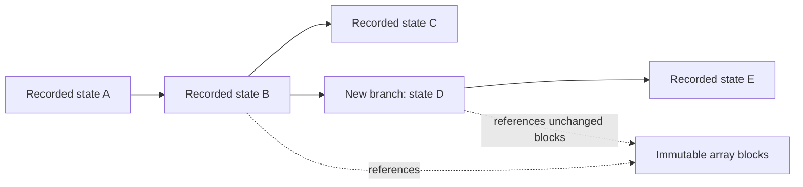

# Append-only calculation history

2026-09-25. This expands [results and continuation](results-and-continuation.md):
what a saved entry contains, how to restore it, and how to continue on a new branch.
Schemas, the values each method saves, recording frequency and filesystem support
still need focused study.

Draft 0.2 retains the logical restoration/branching semantics. Its physical
file-based publication protocol is a candidate, not a storage or deployment
decision. The [core storage boundary](core-structure.md#5-storage-responsibilities-without-premature-deployment-choices)
leaves database and array-container choices open. The model in section 7 concerns
the earlier abstract file-publication candidate, not an eventual DB implementation.

## 1. What the history stores

Selecting a retained point recovers the state recorded there, including its
retained history. Continuing appends a branch without modifying the original
future. This operation establishes neither physical reversibility nor identical
future numerical execution. The calculation method determines whether those saved
contents suffice for the requested continuation.

The archive stores saved values and history. The running driver updates its
working arrays in CPU/GPU memory. A completed save adds a new point to the archive;
later work can be lost on failure. The driver still uses ordinary loops and
function calls. It need not allocate an immutable object or write an event for
each arithmetic operation.

Printed progress and selected observables are readable views of a calculation.
Their presence alone does not imply that the full method state was recorded.
The archive explicitly distinguishes observations from saved state. Inspection
can work at an observation for which continuation is unavailable.

Arrows between states record continuation ancestry. They do not express physical
time reversal, an inverse numerical operation, or a proof that two paths agree.

## 2. Entries and payloads

The proposed entry uses a small versioned manifest: a description of the saved
fields and references to immutable array blocks. HDF5 is a candidate container
for those blocks; what an entry means does not depend on that choice.
The archive can be physically segmented and distributed across writer shards.
It need not be one ever-growing file or funnel all arrays through one rank.

| Entry content | Meaning |
| --- | --- |
| Archive, entry and branch identifiers | Stable lookup and publication identity; unrelated to MPI rank or physical time |
| Continuation parent | The selected preceding state for this procedure, if any |
| Source references for initialization/import | States used to construct a new procedure; separate from continuation ancestry |
| Method and schema versions | Select the concrete decoder and stage interpretation |
| Resolved model, controls, representation and atomic-data references | Establish the context of the saved state |
| Method stage and counters | Describe where the driver paused; counters have method-defined meaning |
| Method records | Explicit scalar values, histories and named array references |
| Payload index | Shapes, scalar encoding, axes, logical extents, byte locations and integrity information |

Immutable configuration/data descriptions can be shared by reference. A changed
configuration gets a new reference through the method's explicit change operation.
The record does not need a copy of every static input at each iteration. Required
external atomic data must remain locatable by content identity; a portable export
must explicitly include permitted data or declare its external prerequisites.

Observation entries contain the actual quantities and their evaluation stage.
An association with a nearby saved state is labelled as such; it does not imply
that the observation was evaluated on exactly that state's fields. Run outcomes
are appended separately, so a delivery failure does not overwrite saved calculation
values. When preparing to continue, the method's constructor checks whether the
saved data meets its requirements.

### A complete field index, with shared immutable blocks

Proposed baseline: each saved state has a complete index of its recorded fields.
Loading reads the index and referenced blocks. It does not rerun the calculation
or follow an unbounded chain of arithmetic differences between saved points.
The manifest may reference hierarchical index blocks to bound metadata size.

Unchanged blocks can be referenced again; changed blocks get new storage. Reuse
requires established immutability or verified exact encoding equality. Equal
shapes, nearby values or the same physical observable do not establish equality
of saved state. A checksum helps detect damaged bytes; it cannot decide whether two differently
represented states are physically equivalent.
Lossless encodings preserve recorded scalar representations; reduced-precision
exports have distinct semantics. Arithmetic subtraction/addition of floating-point
deltas is not assumed to be an exact storage codec.

Continuously changing dense arrays may provide little block reuse. The design
does not assume that compression or sharing makes recording cheap. Initial
payload blocks may be coarse writer-owned slabs, with chunk size decided by IO
measurements. Cross-archive deduplication and long delta chains are deferred.

Continuation ancestry and storage dependencies are distinct. A method's mixer or
thermostat history is saved in its payload; following parent links must not be
used to invent omitted algorithm state. Conversely, a shared payload remains
necessary even if the entry that first wrote it is not an immediate parent.
If an ancestry manifest is lost but a point's own complete field index and
required blocks survive, restoration of those recorded values can still succeed.
Report the ancestry gap separately. Missing data actually required by the method
is a different failure. An intact chain of parent links does not show that the
method has everything it needs to continue.

## 3. Operations available to callers

| Operation | Result and responsibility |
| --- | --- |
| List/inspect | Read branch ancestry, recorded stages and selected quantities without running a calculation |
| Restore | Decode a specified point's recorded values/history into an immutable method record |
| Continue | Let the selected method construct its session from that record, then append a new branch |
| Initialize from | Explicitly select quantities from a prior point to construct a new calculation |
| Export | Write selected state/results and required dependencies in a declared native or compatibility format |

Restoration can succeed when continuation is unavailable: a newer method may have
no compatible session constructor, an external provider may lack resumable state,
or the entry may contain only a partial method record. Inspection reports what is
present. Continuation reports the actual missing or unsupported prerequisite;
there is no silent reset of history. A persisted boolean claiming completeness is
not a substitute for the concrete method decoder and constructor.

Restoration itself performs decoding, integrity checks and data movement. Building
operators, evaluating forces, regenerating an omitted cache or starting an
external provider happens during preparation to continue. A transformation such
as basis projection produces a new record naming the transformation. It does not
rewrite the old entry and call it the original state.

For an exact record restoration, encoding conversion must preserve the represented
scalar bits, array ordering and stage meaning. If a consumer needs normalization,
projection, lossy conversion or a semantic migration, expose that as a separate
operation. Allocation addresses, device handles and MPI resources are recreated;
they are not saved calculation values.

### Branch identity and selection

Every resumed execution session receives a new branch identifier and an explicit
source entry. The first successfully saved state on that branch names the source
as parent. Later states name their predecessor. A failed preparation may produce
an attempt/outcome record without inventing a new calculation state.

Entry identifiers include archive/session identity and an append sequence. Numeric
steps and timestamps are descriptive fields; neither uniquely identifies a state.
Entry identity is fixed before publication so recovery can check the same target
after an ambiguous failure. An identifier is never reused for different contents.

The baseline permits one active writing session per archive under the existing
run-directory ownership protocol. MPI writers are participants in that session.
Readers consume immutable entries. Concurrent branch writers require a separately
qualified coordination protocol; the directory lock is not silently weakened.
Separate archives can support independent concurrent jobs after explicit export
or initialization with their declared data dependencies.

Once branches exist, an archive-wide “latest” cannot identify the caller's
intended continuation. A caller chooses
an entry or a branch. A branch-head hint accelerates lookup; immutable parent links
establish the history. If recovery discovers competing tips for a purportedly
linear branch, report the ambiguity instead of choosing by timestamp. Calculation
states have no generic merge operation. A method that combines prior results
constructs a new calculation with multiple explicit source references.

## 4. From working state to a recorded point

Each method defines the stages at which it can provide a snapshot. A driver
coupling several methods must save their values at matching stages. Saving the
latest available data from each child independently may mix different stages.
MPI/device operations affecting the snapshot must finish before its bytes are
written.

The initial implementation holds a read-only snapshot while serialization runs.
This may pause the relevant driver. An asynchronous version must own an independent
snapshot or freeze every referenced allocation until copied. Merely handing an IO
worker pointers to solver memory that is still changing is insufficient. Each
method exposes the named values and arrays to save through its own interface.

The core passes those views to storage. Each method decides what history it needs
and where it can pause. An intermediate stage can be saved for continuation only
when the method defines both its record and how to resume from it.

Recording policy separately specifies observations and saved method states.
Proposed controls select supported method boundaries and a cadence, with explicit
initial/final/controlled-stop requests. A wall-time request waits for a supported
boundary; it cannot guarantee a save before an arbitrarily close scheduler kill.
Storage/memory estimates include snapshot buffers and pending writes. If a required
save cannot complete, report failure and retain prior points. Changing requested
cadence or dropping required fields to relieve pressure requires an explicit policy.

No workload or recording frequency has been selected here. Their IO cost and useful
rewind granularity need measurement with actual method payloads.

## 5. Publication, acknowledgement and recovery

The physical protocol refines the earlier generation proposal:

1. Allocate a noncolliding entry identity, fix its parent/configuration references,
   and obtain the coherent snapshot. The parent and every reused block must
   already be durably available under the archive's qualified storage semantics.
2. Participating writers create fresh payloads. Each closes them successfully
   and performs the required file and directory persistence operations. The
   coordinator receives readiness only after those operations succeed.
3. Build the complete manifest, including logical coverage of distributed arrays.
   Missing/overlapping extents are errors. Persist it and the containing temporary
   directory. Failure before this stage leaves an unpublished attempt.
4. Publish the manifest/generation under its final unique name using a qualified
   atomic namespace operation that cannot replace an existing entry. Persist the
   containing directory. Its appearance and its durability are distinct events.
5. Acknowledge a completed save only after those durability operations succeed.
   An optional branch-head hint can then be refreshed. Hint failure leaves the
   saved entry discoverable; it does not invalidate the saved state.

Linux documents directory synchronization separately from file synchronization.
Its rename documentation also describes an NFS case where a rename can take
effect even though the caller receives an error. An error after publication starts
can therefore leave an **uncertain save outcome**. Preserve the identity and
inspect that exact entry during recovery; do not overwrite it or blindly allocate
a second version of the same save. These are design consequences to qualify for
each supported filesystem, not a claim of portable durability from a filename.
[fsync](https://man7.org/linux/man-pages/man2/fsync.2.html),
[rename](https://man7.org/linux/man-pages/man2/rename.2.html).

Live readers may encounter a complete visible entry before the writer has received
durability acknowledgement. They must not advertise visibility as a durable-save
receipt. A new writer acquires archive ownership and validates and persists its
selected source dependencies before acknowledging descendants. A writer that is
still active supplies its acknowledged boundary through its session interface;
a cache or a second ad hoc marker does not remove the durability question.

Recovery enumerates final entries, validates their manifests/payload dependencies,
and reconstructs branches independently of hints. A surviving complete final entry
may be usable even if its writer never received success. Temporary files remain
unpublished; no automatic promotion is inferred from their apparent completeness.
A corrupt explicitly selected entry fails restoration of its affected contents.
An ancestry gap is reported without discarding independently intact recorded
contents. Listing can identify other available points without substituting one
for the caller.

HDF5 SWMR supplies a particular live-reader protocol with object-creation and
flushing restrictions. It does not replace this multi-payload publication protocol.
Baseline history readers open completed immutable payload containers; live
observation streaming can be considered separately.
[HDF5 SWMR](https://portal.hdfgroup.org/documentation/hdf5/latest/_s_w_m_r_t_n.html).

## 6. Retention and external interactions

The proposed baseline never automatically deletes committed state. Space limits
are operational constraints, not permission to erase earlier branches. Explicit
pruning/compaction needs its own dependency and reader-ownership protocol before
being enabled. Until then, export selected histories to a new archive and retain
the source as the user chooses. An export states any omitted ancestry and keeps
every payload required for the points it promises to restore.

Restore does not reissue external force requests or repeat earlier external side
effects. Continuation opens a new session under the method/provider's actual
protocol. A log can record an external reply but cannot thereby restore hidden
provider state or undo an action outside the archive. An unresolved external
request remains unresolved until its protocol establishes what happened.

Compatibility files are exports of selected native quantities/state or directly
requested outputs with the same quantity definitions and units. Their legacy append rules
cannot mutate the native history. Exported VASP restart files may
carry less history than the native method record; document that specific limit.

## 7. Bounded protocol exploration

[calculation_history.py](../../models/calculation_history.py) is an original,
standard-library Python breadth-first exploration of a finite transition system.
It represents an existing root and future, a new branch from the root, and one
successor on that branch. The first new entry has two independently written
payloads; the successor shares one. Phases distinguish preparation, visible
publication, directory durability and caller acknowledgement. Stops and one crash
are considered at every reachable boundary; an uncertain publication outcome is
included. A non-durable visible name may survive or disappear.

The checks require that acknowledged entries survive the modeled crash, all
recovered entries have their payloads and parents, the old future remains present,
and stale hints do not prevent discovery. Explicit missing-block cases reject
restoration of affected entries; a missing parent is exposed as an ancestry gap
while intact recorded contents remain readable. The immutable contents are abstract symbols;
storage immutability and successful persistence are assumptions of the model.

Run with `python3 models/calculation_history.py` (Python 3.10 or newer).
The current run explores **60 states, 73 transitions and 66 crash-recovery cases**.
It also prints reachable traces for publication without acknowledgement,
uncertain publication, and two saved entries with a stale branch hint. All stated
bounded checks pass. These counts describe this small model only.

This is not an implementation test, filesystem simulation, proof for arbitrary
history sizes, or a test that a numerical method can continue correctly. It abstracts away payload
bytes, checksums, torn writes, MPI communication, live-reader synchronization,
multiple archive writers, repeated recovery and pruning. Those remain under
`exv-0ex`, `exv-w0s` and `exv-mqh`; method payload sufficiency remains under the
focused subsystem studies. The model makes the publication/acknowledgement
distinction inspectable without claiming deterministic physical or numerical replay.
