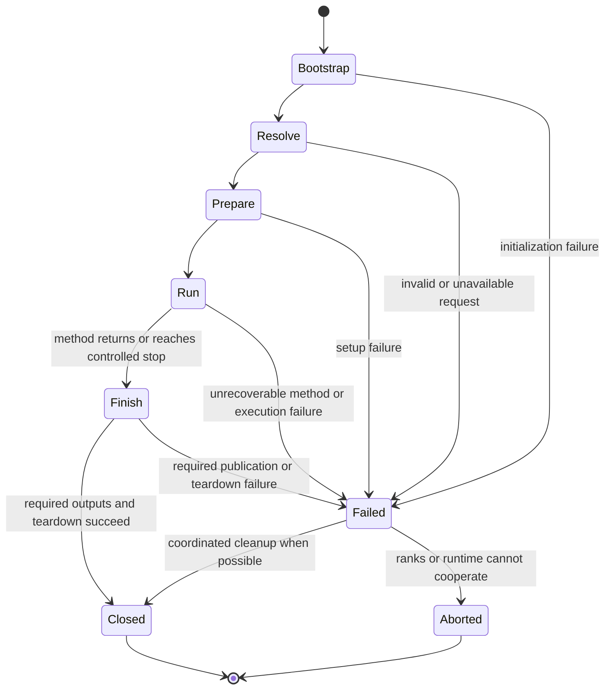

# Execution, lifecycle and resource ownership

Part of [design draft 0.2](README.md). The core executes researcher-selected
procedures on CPU and NVIDIA, with AMD later. It does not select a physical branch
or substitute another scientific method in response to a runtime problem.

## 1. Application lifecycle

This lifecycle concerns resources and process behavior. A driver's internal
algorithm has its own states. `Run` can contain nested SCF iterations, integration
stages, response solves or repeated evaluations; the core does not flatten them.

| Phase | Owned resources and permitted effects |
| --- | --- |
| Bootstrap | Parse minimal launch options; initialize or attach to MPI; discover ranks/devices and small diagnostic channel |
| Resolve | Input owner resolves scientific choices and shares them; reject unavailable operations; preserve existing calculation files |
| Prepare | Establish communicators, allocate and construct driver; open new output segment only after output ownership is established |
| Run | Driver advances science and exposes coherent output/stop boundaries; execution may overlap local work and transfers |
| Finish | Drain required work, publish requested results/checkpoint and outcome, explicitly release resources |
| Failed | Preserve prior published checkpoints; report error and available partial results; attempt only feasible coordinated cleanup |

The CLI owns MPI initialization/finalization if it performed initialization. An
embedded caller can supply an existing communicator/context; Exvasperated
borrows or duplicates it under a documented ownership rule and never finalizes
the caller's MPI runtime. The initial library API serializes driver entry per
context. Concurrent calculations need distinct contexts and compatible process
participation; “thread safe” is not an unconditional distributed API promise.

## 2. Distributed bootstrap and control

The first distributed baseline uses **the MPI-initializing thread for all MPI
calls**, including any parallel IO calls that invoke MPI internally. CPU workers
perform local computation. Check the thread level actually supplied; request
at least FUNNELED when workers exist. The reader study explains this constraint
from the [MPI thread definitions](https://www.mpi-forum.org/docs/mpi-5.0/mpi50-report/node269.htm).
A library called from another thread cannot assume FUNNELED is satisfied.

After bootstrap, the designated owner reads command/input metadata. It distributes
a success/error result before peers enter dependent work. Device discovery and
allocation failures are likewise reported at planned agreement boundaries. A
rank cannot return from preparation while peers enter the next data collective.

Communicators express actual decompositions: independent calculations/images,
reciprocal samples, bands/subspaces or spatial/FFT partitions as needed by the
method. There is no universal fixed communicator tree imposed on all families.
Construct the selected topology consistently across its participating ranks.
Print effective rank/device mapping and numerical-library configuration.

Driver communication phases have a common operation order on each communicator.
Independent overlapping activities use distinct communicators where appropriate.
Local callback timing does not determine collective order. A dedicated control
communicator prevents message confusion, but does not make a blocked process
available or remove cyclic waits in the data path.

### Handling errors without creating a new deadlock

1. **Before a communication phase:** all participating live ranks report local
   readiness at the scheduled agreement point; either all enter or all leave.
2. **Inside a phase:** complete/cancel only requests for which the API and state
   permit that action. Do not branch unilaterally into a new error collective.
3. **At a completed phase boundary:** combine detected errors and stop decisions;
   the driver chooses a method-supported next action or returns failure.
4. **Rank loss, broken communicator or indefinitely stuck work:** best-effort
   diagnostics followed by MPI/job abort or launcher termination. Alpha does not
   promise in-place rank recovery or a new checkpoint from the damaged state.

These rules address application-created ordering errors. They do not guarantee
recovery from hardware or MPI failures. The relevant constraints are documented in
[MPI collective correctness](https://www.mpi-forum.org/docs/mpi-4.1/mpi41-report/node172.htm)
and [MPI error handling](https://www.mpi-forum.org/docs/mpi-4.1/mpi41-report/node252.htm).
Fault-injection tests must include failures immediately before a collective and
while other ranks are progressing; a final all-reduce is not a general remedy.

## 3. Execution plans and placement

Planning maps the selected operations to concrete implementations and layouts.
It reports required persistent arrays, peak scratch, communication staging and
output/checkpoint buffers. Plans are specific to a calculation's representation,
rank topology, device and selected numerical modes. Numerical values and physical
histories are not encoded into a universal execution graph.

CPU is a complete execution target, not only a host for GPU setup. NVIDIA mode
can intentionally use both CPU and device operations; the supported placement is
reported. A missing GPU operation discovered in planning causes a clear error
unless the requested execution policy explicitly permits the implemented host
route. Runtime out-of-memory does not silently change basis, precision, band
count, physical approximation or solver. Retiling that preserves the selected
operation is allowed only where its implementation defines and tests the effect.

Assign devices using the launcher-visible device set and node-local rank mapping;
report oversubscription and obey explicit placement. Do not assume global rank
modulo the physical GPU count is the intended assignment. Exact discovery and
scheduler integration remain part of target qualification.

The numerical adapter surface is operation-specific: transform plans, matrix
products, factorizations/eigensolvers, reductions and family kernels. It includes
precision/compute mode, shapes/strides, workspace, stream, status and completion.
No scalar-level virtual tensor API is required. A family may choose a fused kernel
where its mathematics and measurements justify it.

## 4. Asynchronous ownership

A scientific value's logical identity and its storage location differ. A typed
field/view names its representation; its storage can be host or device resident.
A redistribution or transfer produces a view of the same logical entries through
a defined index map. An orbital basis projection changes the represented object
and belongs to the scientific family.

The safe execution API must ensure:

- Exclusive mutable access excludes concurrent readers/writers unless an operation
  explicitly implements the required synchronization.
- A submitted operation keeps every allocation, workspace, plan, stream and
  context it uses alive until completion, including raw-pointer FFI accesses.
- A host-readable result is available only after the required completion/transfer.
- Reused workspace waits for all previous users. A dropped host handle cannot
  make an in-flight allocation reusable.
- Failure during submission or event recording does not release possibly active
  memory; drain where safe, otherwise retain it until context/job teardown.

Prefer moving owning handles into pending operations while allocations remain
resident. Completion returns results and reusable resources. An execution context
owns the relevant runtime, with explicit failure cleanup; it need not centrally
track every scientific value. Internal event dependencies can avoid whole-device
waits. The [ownership refinement](core-structure.md#3-ownership-and-asynchronous-execution)
distinguishes rejection before submission from uncertain in-flight work. Host
lifetimes alone do not prove device completion; concrete adapter design remains
required before code.

The [cudarc reading](../research/core-design-study.md#6-a-rust-borrow-ending-does-not-mean-a-gpu-operation-finished)
provides a concrete comparison. Its tracking cannot automatically account for
our foreign accesses. Every native-library adapter must participate in our
ownership/completion scheme rather than extracting a pointer and assuming the
upstream wrapper manages the entire lifetime.

For GPU-aware MPI, establish producer completion before communication and consumer
ordering after it. Do not assume MPI understands a CUDA stream merely because it
accepts a device pointer. Support a deliberate pinned-host staging path. Test both
routes on selected MPI/device combinations; raw buffer ownership lasts until the
MPI request completes. No background progress is assumed without measurement.

## 5. CPU concurrency, numerical behavior and performance

Choose one explicit threading arrangement for a workload: application workers,
threaded native BLAS/FFT, or a measured combination. Avoid accidental nested
oversubscription. Allocation pools and FFT/solver plans are scoped to the execution
context and its supported concurrent use; a workspace shared across simultaneous
calls needs exclusion or separate storage.

Each numerical operation states its compute precision and reduction strategy.
The initial electronic baseline is real/complex FP64. Mixed precision or emulated
arithmetic is introduced through explicitly selected, independently checked
methods, rather than silently enabled by a backend's faster default.
Deterministic numerical replay is not an established project goal. Persistence
restores recorded state and retained history without requiring identical future
execution. Method-specific scientific comparisons must establish the relevant
quantities, histories, distributions or trajectories and their justified equality
criteria or tolerances. Any future deterministic execution proposal first needs
an explicit purpose and scope; it does not follow from checkpointing support.

Measure whole driver phases, transfers, communication and device work. Host enqueue
time is not GPU elapsed time. Profiling uses bounded buffers and explicit
synchronization only at selected measurement points, since instrumentation itself
can change overlap. Memory reports include live workspaces and pending IO.

## 6. Stops, callbacks and failures

Signal handlers set only a stop request using platform-safe machinery. They do
not allocate, invoke MPI, write HDF5 or serialize scientific state. Drivers poll
at specified boundaries and coordinate the request among their ranks. A wall-time
budget should reserve estimated checkpoint time, while making clear that a long
uninterruptible operation may overrun it.

Observers receive immutable bounded views of method progress. They cannot mutate
the scientific procedure. A stop request is a separate narrow channel. Scientific
extensions are explicit operations described in [interfaces](interfaces-and-compatibility.md),
with their own state and callback ordering.

| Event | Proposed behavior |
| --- | --- |
| Method reaches its specified stopping rule | Finish its required final evaluations and publish its outcome |
| Iteration/time budget reached | Return method-specific partial outcome; do not call it converged |
| User requests a stop | Reach a supported boundary if feasible, publish continuation if requested, mark interrupted |
| Recoverable numerical breakdown | Driver may take only a defined, selected recovery branch; record what changed |
| Nonfinite/domain-invalid numerical result | Method reports the responsible operation; no generic clipping or silent repair |
| Required output/checkpoint fails | Preserve prior committed data; overall operation reports output failure even if computation succeeded |
| Optional human log fails | Report if possible; follow the declared optional-output policy |
| Device context/MPI becomes unusable | Terminate affected job; preserve previously committed checkpoints |

Observer backpressure is bounded. Required scientific output can slow the driver;
optional progress messages may be coalesced under an explicit policy. Queues must
not retain unbounded snapshots of wavefunctions or trajectories.

Teardown is explicit and fallible: finish dependent work, close outputs and
extensions, release plans/handles/buffers, then finalize owned runtimes. Destructors
provide a final local safeguard, not hidden MPI collectives or the main error
reporting path. Panics and foreign exceptions never cross a C ABI boundary;
catching one is not sufficient to resume a distributed scientific calculation.
