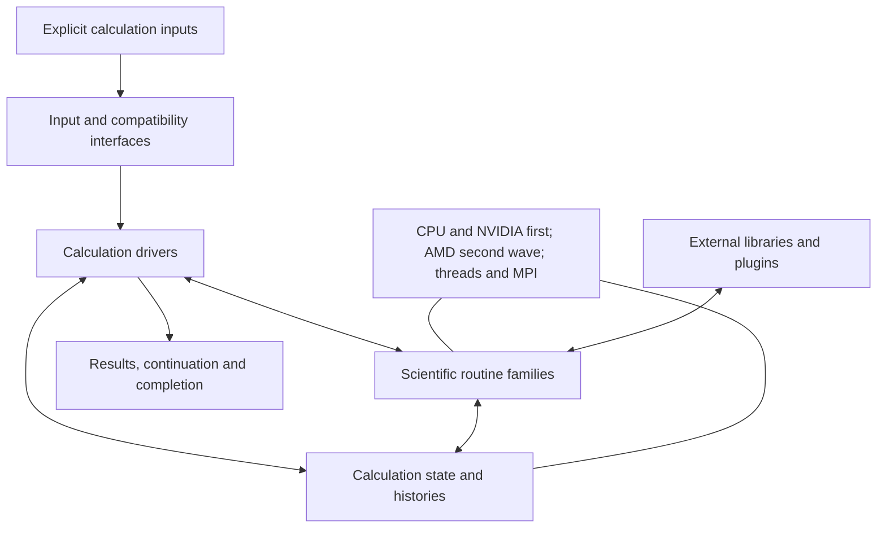

# Core program and scientific routine outline

2026-09-25. Working outline for the literature and reference expedition, derived
from the [reviewed first-pass studies](first-pass/README.md) and the
[project direction](../../INERTIA.md#scientific-routines-and-composition).

The program accepts an explicitly specified calculation, constructs its working
state, runs the selected scientific procedures, and returns results and
continuation data. Researchers choose the methods and compose experiments.
Experiment interpretation and suggestions are a separate possible capability.

This outline defines research responsibilities. The buckets can become several
modules or share implementations after the research establishes suitable
boundaries. Workflow interfaces and state representation remain open; scientific
routines may evolve state and retain history. Following the target revision on
2026-09-25, CPU and NVIDIA GPU execution are required in v1-alpha, with AMD GPU
execution as a second-wave objective. Hardware and library questions run through
the whole map with that priority.

The source evidence concerns selected paths in VASP 6.5.1. All 20 study areas
inform this outline, including their unread bodies and unresolved questions.
The expedition must reconcile this map with versioned public capabilities and
real workloads. Complete method coverage and scientifically meaningful feature
combinations remain to be established.

The [broad reference campaign](reference-campaign/README.md) supplies material for
the overall design. Before detailed design and implementation of each subsystem,
undertake a focused deep expedition and scientific re-grounding for that
subsystem. Broad coverage in this map or catalog is not sufficient preparation.

## 1. Shape of the program

This is a responsibility diagram. Scientific methods determine their own
iterations, updates and stopping quantities. A self-consistent electronic solver,
a thermostat, and a time propagator each contain substantial scientific control
flow. The core connects and executes the selected procedures and manages their
resources. The mathematical content of a driver belongs with its scientific
routine family.

## 2. Core program responsibilities

| Responsibility | What it includes | Questions for the expedition |
| --- | --- | --- |
| **Input and compatibility** | Invocation, ordinary configuration parsing, defaults and explicit overrides, structures, scientific data selection, existing file and downstream-tool interfaces. | Which versioned meanings and observable behaviors do researchers and tools depend on? Which inputs select a method, change an approximation, or merely control execution? |
| **Construction, storage and lifetime** | Construct scientific objects; hold physical state, derived objects and histories; allocate, share and release storage; perform scientifically defined representation changes. | What state does each operation actually require? Which objects may share storage? When is reconstruction equivalent, and what must continuation preserve? |
| **Calculation drivers** | Dispatch requested methods, connect their inputs and outputs, nest or sequence their calls, honor the chosen procedures and expose their outcomes. | What are the established compositions and their actual state changes? Which loops and update rules are scientific algorithms that need their own derivation? |
| **Execution and build support** | CPU/GPU placement, MPI and threads, distributed layouts, communication, synchronization, numerical-library bindings, supported builds and installation. | Which decompositions and kernels suit CPU/NVIDIA alpha execution? What are their precision, memory, communication and scaling consequences, and the implications for later AMD support? |
| **Results, continuation and completion** | Output formats, calculated quantities and diagnostics, trajectories, restart serialization and adaptation, requested stops, numerical failures and process cleanup. | What exactly is saved or reported? What distinguishes continuing a trajectory or search from starting a new one with a useful guess? How do consumers observe partial or failed calculations? |
| **External interfaces** | Foreign-library calls, plugins, external calculators and exchange with other scientific programs; shapes, units, ownership, callback ordering and distributed behavior. | What is contributed or replaced at each interface? Which operations alter the physical model or evolution? What can external code retain or mutate? |

Source basis: [execution](first-pass/execution.md),
[input/output](first-pass/io.md), [foundations](first-pass/foundations.md),
[parallel execution](first-pass/parallel.md), [plugins](first-pass/plugins.md),
and the scientific studies below.

Storage and lifetime rules must follow established scientific meaning. Calling
an object derived or cached does not establish that discarding and rebuilding it
preserves a calculation. Physical path dependence, numerical history and their
interaction need method-specific treatment. No additional apparatus for policing
experimental intent is part of this outline.

## 3. Scientific routine buckets

The numbering is for discussion and research navigation. The first three buckets
supply widely shared mathematics and representations; subsequent buckets contain
physical contributions, solvers and observables. Every bucket includes its
relevant derivatives, numerical domains, approximation choices and state changes.

| # | Bucket | Routine families and scientific products | Main questions for references |
| --- | --- | --- | --- |
| 1 | **Numerical primitives** | Dense and distributed linear algebra; generalized eigenproblems; orthogonalization and factorizations; FFTs; quadrature, interpolation, special functions, root finding, fitting and random sampling. | Conditioning, rank and near-singular cases; backward/residual errors and their interpretation; precision; library behavior and availability on each target. |
| 2 | **Geometry, symmetry and physical representations** | Cells and coordinates; periodic mappings; reciprocal sampling and integration weights; symmetry reduction/reconstruction; plane-wave bases, grids, fields, orbitals, spinors and transformations. | Normalization, phases and gauges; spin and magnetic symmetry; changing cells/bases; reduced storage; which transformations preserve which physical quantities. |
| 3 | **Atomic physics, datasets and PAW** | Radial atomic calculations; partial waves and projectors; overlap operators; augmentation and compensation charges; core/valence reconstruction; atomic reference data and their preparation. | Dataset completeness, transferability and independent generation/acquisition; relativistic choices; generalized metrics; cancellation of smooth and atomic contributions; derivative consistency. |
| 4 | **Electrostatics and boundary conditions** | Charge assembly; Hartree and ionic electrostatics; local ionic potentials; periodic and truncated interactions; applied fields, dipole/charge corrections and environmental-model interfaces. | Singular and long-wavelength limits; boundaries and energy references; compensation; field coupling; available environmental implementations and their actual scientific scope. |
| 5 | **Exchange-correlation, spin and orbital terms** | Local, gradient and kinetic-density functionals; potentials and higher derivatives; orbital-dependent corrections; magnetic constraints; spin-orbit coupling and other spin-dependent terms in conjunction with atomic reconstruction. | Which energy, operator and response expressions exist for each method? Spin conventions, low-density domains, subspace definitions, double counting and constraint forces. |
| 6 | **Nonlocal exchange and dispersion** | Exact and screened exchange; compressed exchange operators and local exchange reconstruction; density-based nonlocal correlation; atom-based dispersion and many-body dispersion. | Distinct approximations and data requirements; singular terms; self-consistency; compressed-operator construction and reuse; forces/stress; composition with bucket 5. |
| 7 | **Stationary electronic calculations** | Kinetic operators; Hamiltonian/overlap application and assembly; orbital optimization; self-consistency and mixing; occupations and chemical potentials; density reconstruction; energies, bands and density-of-states evaluation. | What equations are solved and what remains fixed? Residuals, degeneracies, competing solutions, metallic occupations, smearing versus physical temperature, and branch effects of initialization and numerical history. |
| 8 | **Forces, stress and other energy derivatives** | Position and strain derivatives, including basis, overlap, PAW, functional, exchange, dispersion, field and constraint contributions; assembly of forces and cell-driving quantities. | Which scalar or variational expression is differentiated? Electronic stationarity, basis dependence, stress conventions and consistency of all constituent terms. |
| 9 | **Atomic motion, statistical sampling and transition paths** | Geometry/cell optimization; molecular dynamics; thermostats and barostats; stochastic and constrained evolution; bias histories and enhanced sampling; image paths, saddle searches and replica exchange. | Evolution equations, integration/sampling measures, optimization versus physical time, constraints, stationary-point character, history, random state and continuation. |
| 10 | **Perturbation response and spectroscopy** | Electronic and ionic linear response; finite-field polarization; dielectric and independent-particle optical quantities; magnetic response; NMR, hyperfine and electric-field-gradient observables; core-level calculations. | Perturbation definitions; occupied and empty subspaces; gauge, degeneracy and polarization branches; finite-difference ingredients; core reconstruction and reference alignment. |
| 11 | **Lattice vibrations, electron–phonon coupling and transport** | Force constants from displacements/response; dynamical matrices and interpolation; polar corrections; electron–phonon matrix elements and self-energies; lifetimes and transport tensors. | Mass/phase/frequency conventions; acoustic constraints and instabilities; long-range separation; coupled electronic/phonon sampling; scattering approximations and singular transport limits. |
| 12 | **Localized representations, embedding and analysis** | Local projections, Wannier/localized orbitals, disentanglement and interpolation; populations and charge partitioning; embedding spaces; interaction/integral export and external-solver exchange. | Subspace rank, metric and gauge; what each projection or population measures; interpolation accuracy; embedding assumptions; what is an implemented solver versus an interface. |
| 13 | **Screening, correlation and electronic excitations** | Polarizability and screened interactions; quasiparticle calculations (GW); correlation energies (RPA and MP2 families); constrained screening; electron–hole excitations (BSE); related rates and correlated derivatives. | Held-fixed versus updated quantities; frequency/time representations; continuation and multiple roots; causality; stochastic error; correlated forces; coupling to localized subspaces. |
| 14 | **Electronic time evolution** | Time propagation of electronic states and electron–hole amplitudes, their field/interaction feedback and time-dependent observables. | Actual equations and propagators supported; preparation; feedback approximations; metric/basis evolution; stability and conservation in applicable limits; continuation. The source pass sampled setup only. |
| 15 | **Learned interatomic models** | Atomic environments and descriptors; energy/force/stress prediction; regression and fitting; sparse selection; uncertainty estimates; acquisition of electronic reference calculations; model/data continuation. | Invariance and derivative consistency; target scaling; conditioning; calibration and domain shift; acquisition history; interoperability of model formats and execution paths. |

Buckets 6, 10, 11 and 13 each contain distinct method families and will need
smaller research passes. Their grouping gives related questions a home; it does
not imply one universal solver. Likewise, bucket 15 combines the two source
implementation areas into one scientific subject without assuming their models
or formats are interchangeable.

### Source-study connections

| Buckets | Studies supplying findings and unresolved questions |
| --- | --- |
| 1 | [Numerics](first-pass/numerics.md), [foundations](first-pass/foundations.md), [representation](first-pass/representation.md), [parallel execution](first-pass/parallel.md) |
| 2 | [Geometry](first-pass/geometry.md), [representation](first-pass/representation.md), [foundations](first-pass/foundations.md) |
| 3 | [PAW](first-pass/paw.md), [localized representations](first-pass/localized.md) |
| 4 | [Electrostatics](first-pass/electrostatics.md), [response](first-pass/response.md) |
| 5 | [XC and corrections](first-pass/xc.md), [PAW](first-pass/paw.md), [representation](first-pass/representation.md) |
| 6 | [Nonlocal interactions](first-pass/nonlocal-interactions.md), [XC](first-pass/xc.md) |
| 7 | [Electronic solution](first-pass/electronic-solution.md), [electrostatics](first-pass/electrostatics.md), [PAW](first-pass/paw.md) |
| 8–9 | [Ions](first-pass/ions.md), with derivative contributions from the relevant operator studies |
| 10 | [Response](first-pass/response.md), [electronic solution](first-pass/electronic-solution.md) |
| 11 | [Vibrations](first-pass/vibrations.md), [response](first-pass/response.md), [ions](first-pass/ions.md) |
| 12 | [Localized representations](first-pass/localized.md), [many-body methods](first-pass/many-body.md) |
| 13–14 | [Many-body methods](first-pass/many-body.md), [response](first-pass/response.md), [electronic solution](first-pass/electronic-solution.md) |
| 15 | [Fortran ML](first-pass/ml-fortran.md), [C++ ML](first-pass/ml-cpp.md), [plugins](first-pass/plugins.md) |

Atomic datasets deserve a reference workstream alongside routines. Compatibility
with a data interface and the availability of suitable openly distributable data
are separate questions. The same attention applies to dispersion parameters,
fitted quadrature coefficients and trained models. Quarantined tables, models
and fixtures are research material, never an automatic source for our artifacts.

## 4. Boundaries that the research must settle jointly

Individual routines need deep examination, and several questions require following
a quantity through more than one bucket. These are concrete starting points for
the expedition rather than a generic runtime validation layer.

| Connection | Joint question and useful reference problem |
| --- | --- |
| **Representation → operator → solver** | Does the same physical state retain its meaning through basis, phase, spin and layout changes? Study degenerate subspaces and generalized overlap metrics, with independent operator/residual checks. |
| **Atomic data → energy → derivatives** | Do atomic and smooth contributions combine consistently, including under displacement and strain? Find independent atomic/solid reference calculations and derivative comparisons for matched models. |
| **Functional → potential → response** | Which derivatives belong to the selected energy expression, and which methods supply a potential without a corresponding energy formulation? Establish method-specific checks before using energy differences as a universal test. |
| **Electronic solve → forces → motion** | How do electronic errors and solution branches affect subsequent forces and updates? Investigate difficult convergence and branch-sensitive paths with explicitly specified initialization and procedures. |
| **State history → continuation** | Which histories are physical, which belong to the numerical procedure, and how do they interact? Compare defined continuations for field cycles, biased/stochastic dynamics and learning, without assuming that identical external controls determine one state. |
| **Response → phonons → transport** | How do electronic accuracy, projection of sum rules, unstable modes and limiting prescriptions affect the resulting observable? Examine raw and transformed quantities and independent formulations where available. |
| **Localized spaces → screening/correlation** | How do gauge, rank, band windows and metric affect target spaces, screening and excitation results? Find small independently tractable examples and controlled subspace variations. |
| **Routines → CPU/GPU/MPI execution** | How do ordering, reductions, storage precision and parallel decomposition affect accuracy and branch-sensitive behavior? Assess each target using observables and method-specific error reasoning; decide where bitwise, numerical or statistical comparisons are meaningful. |

Hysteresis and competing solutions belong in the scientific investigation. A
desired phase, a small energy change, or apparent agreement after symmetry
projection cannot establish the correctness of a path. Conservation and
derivative checks must be applied under the assumptions that make them valid.
The expedition should expose these assumptions before design encodes them.

## 5. What the literature and reference expedition should return

For each family, assemble an account sufficient to design and independently
implement its routines:

1. **Mathematics and physical domain.** Primary derivations, subsequent corrections
   and limits of applicability; equations, approximations, quantities held fixed,
   units, normalization, boundary conditions, derivatives and relevant histories.
2. **Numerical methods and difficult cases.** Established algorithms, conditioning,
   discretization and stopping behavior, finite precision, competing solutions
   and known failure mechanisms. Identify where alternative methods calculate
   different things even when their interface names look similar.
3. **Independent implementations and scientific data.** Candidate reference codes,
   libraries, datasets and generation procedures, with origin, version and terms
   of use. Determine actual mathematical independence and suitability before
   treating agreement or code availability as evidence for adoption.
4. **Discriminating problems and real workloads.** Analytic/limiting cases where
   available, independently tractable numerical examples, difficult regimes and
   named scientific workloads from the literature. Establish why a comparison
   can reveal an error and how its tolerances relate to the observable. VASP
   comparisons, independent verification and physical validation answer different
   questions.
5. **Execution and interface findings.** Primary library/toolchain documentation,
   algorithm studies and bounded measurements for CPU/NVIDIA alpha execution,
   with AMD as a second wave; public versioned formats and actual downstream
   consumers. Include numerical
   behavior, memory, scaling, interruption and continuation where relevant.

Include [cuda-oxide](https://github.com/NVlabs/cuda-oxide) among the NVIDIA kernel
implementation candidates. Evaluate capabilities, numerical behavior, performance
and integration on the workloads we identify. Examine concrete compiler,
toolchain and maintenance evidence; its "alpha" label does not determine the
assessment. Record implications for later AMD work alongside its suitability for
the first wave.

Candidate improvements should arise from this work: for example, more reliable
numerics, more accurate or efficient alternatives, better data availability, or
clearer interfaces. Document the changed approximation and tradeoff whenever an
alternative changes the scientific calculation. Method selection remains under
researcher control.

The expedition also needs a breadth pass over versioned public capabilities and
the incomplete source studies. It must distinguish operational methods, external
extensions, unsupported combinations and placeholders. For example, the localized
study found an inactive auxiliary-field Monte Carlo entry; the electrostatics
study found an environmental interface without the external implementation.
Those findings are leads to resolve, not proof of complete capabilities to clone.
Additional capabilities should extend the outline when their actual scope is
established. This map is not a completed parity inventory.

## 6. Proposed expedition order

1. **Open the breadth, interfaces and data tracks immediately.** Reconcile the
   capability map with public versions and actual workflows; investigate atomic
   data availability; establish CPU/NVIDIA library and execution questions and
   record later AMD work.
   These tracks continue alongside the scientific literature work.
2. **Establish shared mathematics and a complete electronic calculation.** Work
   through buckets 1–7 with bucket 8 close behind. Follow one well-defined
   calculation from representations and atomic data through operators, solution,
   energy and derivatives; preserve the wider range of methods in the outline.
3. **Follow evolution and perturbations.** Study buckets 9–11 together with returns
   to their operator/solver dependencies. History, constraints, branch behavior
   and continuation receive attention here and wherever earlier work exposes them.
4. **Develop the specialized families as their prerequisites become clear.**
   Buckets 12–15 can begin bounded passes before earlier areas are exhausted.
   Localized representations already feed electronic and response work;
   time-evolution setup is a particularly shallow part of the first source pass.
5. **Synthesize design choices with whole calculations in view.** Revisit the
   connections in section 4, resolve enough concrete workloads and target
   behavior to choose representations and component boundaries, and carry
   unresolved questions into further study.

This is an order for acquiring understanding. It does not set an implementation
schedule or narrow scientific capability scope. The work can move between buckets
when adjacent context is more useful than forcing closure. Detailed acquisition,
experiments and follow-up work belong in beads as those tasks are selected.

## Status of this outline

This delivery synthesizes existing reports and project decisions in original
prose. No broad literature acquisition, scientific calculation, target benchmark
or product implementation was performed. The next expedition can use these
responsibilities, routine families and joint questions as its starting scope.
