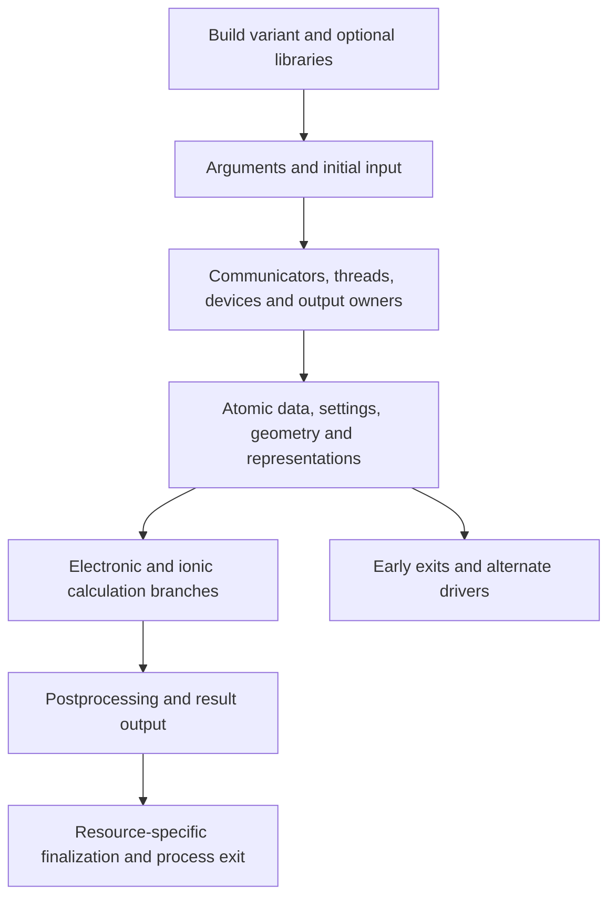

# Execution, build selection and lifecycle

First pass, 2026-09-24. Study area: `execution`, 16 files. This is source
inspection of VASP 6.5.1, not a reproduced build or calculation. The report maps
the lifecycle and several behavior-changing boundaries; individual scientific
branches and complete cleanup correctness remain open.

## Reading scope and file roles

File identities are pinned in the [inventory](../vasp-source-inventory.csv).
Ranges below describe the first pass, not completion of every file's analysis.

| File | Reading in this pass | Role and remaining depth |
| --- | --- | --- |
| `.objects` | Complete list, 1-321 | Assembly order and selected optimization overrides; presence in a list is not reachability evidence. |
| `makefile` | 1-281 | Build variants, preprocessing, libraries, dependency generation and compiler metadata. External architecture settings still matter. |
| `lib/makefile` | 1-48 | Bundled support-library object selection; the long bundled algebra files are not all selected by default here. |
| `makedeps.awk` | 1-36 | Dependency discovery from preprocessed module declarations/imports; it is not a scientific dependency model. |
| `makeparam.F` | 1-2 | Alternate preprocessing entry into the main program. |
| `param.inc` | 1-19 | Fixed dimension declarations; activation and continued relevance require caller/build tracing. |
| `symbol.inc` | Directive scan throughout; 1-100 in context | Representation, arithmetic, library and device substitutions; each relevant branch needs later preprocessed inspection. |
| `main_mpi.F` | 1-486 | Initial input handling, communicator hierarchy, image paths and output ownership. Collective implementations belong to the parallel study. |
| `main.F` | Dispatch/termination search; selected blocks within 518-737, 914-944, 1260-1302, 2558-2577, 3210-3370, 3458-3484, 3673-3704, 5188-5229, 5690-5896 | Lifecycle and convergence consequences; most scientific branches and intermediate state mutations are still partial. |
| `command_line.F` | 1-117 | Sequential argument handling, early exit and dry-run/debug state. |
| `version.F` | 1-36 | Version identity and build-dependent labeling. |
| `build_info.F` | 1-172 | Conditional build metadata emission; logging alone does not establish executed paths. |
| `build_info.inc` | 1-7 | Placeholder metadata replaced during the normal source-preparation step. |
| `tutor.F` | Declarations and procedure search; 475-526 in context | Severity-controlled stopping and MPI termination; full message catalog and logging paths not audited. |
| `profiling.F` | 1-125 | Nested saved timing state and initialization; reporting and all exit paths remain partial. |
| `vasp.cfg` | Header and configuration-setting scan | Doxygen configuration, not physical runtime configuration; generated documentation is not assumed available or complete. |

## The executable is configured before a calculation is specified fully

The build selects three broad executable modes and changes which direction uses
reduced reciprocal storage according to the parallel build. Optional libraries
are also assembled conditionally. These choices precede runtime input and affect
what array declarations and numerical calls mean (`makefile`, 28-86;
`symbol.inc`, 1-100 and device-related directives near 669-814).

This is stronger coupling than a choice of optimized library at link time.
Some source names are replaced by different arithmetic routines, some declarations
change representation, and some lines exist only for a device or host path.
Therefore a source-level call list cannot establish a build's behavior. An
appropriate later question is which preprocessed operator and data layout each
CPU, NVIDIA and AMD build actually uses. This pass makes no claim that all
combinations of methods and targets work.

The object list deliberately puts data types and infrastructure before their
consumers. Some files receive separate optimization settings. The support-library
makefile selects a small default object set and allows overrides. The presence
of several large algebra sources in the distribution does not imply that a
normal executable links all of them. Library choice needs to be traced through
the architecture configuration outside this manifest.

## Inputs and parallel topology are coupled

The parallel startup first initializes MPI, handles arguments, reads input,
and constructs subdivisions for images, reciprocal samples and bands. It then
chooses output owners and can switch subsequent input interpretation to an image
subdirectory (`main_mpi.F`, 85-391). Consequently the early resource settings and
later calculation settings can be read under different input contexts.

Band decomposition controls are normalized against the available ranks. Certain
invalid subdivisions are replaced; multiple host threads and the selected
accelerator path can force a particular band subdivision (roughly 216-246).
The resulting communicator layout is part of effective configuration. This is
an execution adjustment, not evidence of a change to the intended physical model.
Compatibility investigations should compare effective settings and ownership,
not merely the user's original input values.

There are additional paths for unequal image subdivision, shared memory and
reciprocal-point image distribution. This pass identifies these branches but
does not prove their compatibility with all optional methods or with HDF5 input.

## Lifecycle map

This is a map, not a state machine specification. In the ordinary main path,
MPI/thread/device setup precedes the main output-opening block, although
image-local standard output can already be opened during MPI startup
(`main_mpi.F`, 330-337). The structure header and
atomic data are read before the large general settings reader (`main.F`,
518-737); the full structure is read later (930-932). On paths reaching it,
the preparation-only exit occurs after important grid/communication setup but
before the main electronic/ionic loop (2569-2575). Output files have already
been opened, so this is not a side-effect-free parser check. Nor does the flag
universally prevent numerical work: the earlier supplied-force-constant phonon
driver can run and branch to finalization before reaching that check
(1278-1298). These are source-level inferences; no filesystem or calculation
behavior was reproduced.

The main ionic loop starts around 3348, invokes electronic optimization when its
branch permits it (3468-3472), and conditionally invokes forces/stress
(3673-3688). Some jobs take alternate paths: for example a phonon calculation
from supplied force constants branches to finalization before the normal loop
(1278-1298). Electron-phonon and phonon processing also occurs after the ionic
loop (5209-5227). A replacement's job model will eventually need to explain these
different scientific workflows. This report does not select that model.

## Finishing a process and converging the science are different events

The electronic driver may switch optimization strategies on a configured recovery
path and reset mixing history (`main.F`, 5834-5873). If electronic convergence is
still absent, it emits a diagnostic with immediate stopping suppressed, then
changes the ionic-run controls only under the configured severity threshold or
an explicit hard-stop condition (5875-5896). Thus even the convergence flag has
to be interpreted at the correct point in the algorithm, with its caller's policy.

The ordinary finalization path closes various output systems, finalizes learned
force fields and selected GPU resources, stops plugins, then exits
(`main.F`, 5707-5790). Preparation-only and command-line exits call termination
from other locations. In `tutor.F` 475-526, nonzero-error MPI shutdown attempts a
bounded rendezvous and can abort the world communicator; severity and an optional
suppression flag control whether logging requests a stop. This proves neither
universal cleanup nor deadlock freedom. It identifies a concrete contract to
investigate across process, communicator and scientific states.

## Parity implications and candidate improvements

Parity includes effective input interpretation, build-dependent availability,
the location and completeness of outputs on early exit, rank ownership of
messages, continuation semantics and the distinction between user stop,
nonconvergence and fatal failure. A version string or successful process exit
cannot summarize that contract.

Potential improvements to investigate later are explicit effective configuration
and understandable scientific termination reasons. Their value is inferred from
the coupled paths above; no replacement architecture or interface has been chosen.
The current project requires CPU, NVIDIA and AMD alpha execution, so resource
placement and method availability must be understood on all three paths rather
than inferred from conditional source presence.

## Open questions and return conditions

Return after the input and parallel studies to resolve precedence between initial
and image-local settings, exact collective ownership and HDF5 lifetimes. Return
after the electronic-solution study to establish when convergence state changes
meaning and what quantities remain scientifically usable on exit. Return after
the plugin/ML studies to trace alternate calculation and finalization paths.

Useful later probes include preparation-only execution in a fresh job directory,
forced electronic exhaustion under different stop policies, image-local inputs,
and interrupted continuation on each target. These are proposed discriminating
experiments, not tests executed in this pass. No broad reference acquisition,
engine design or implementation was performed.

## Review disposition

The [single independent review](reviews/execution.md) identified two warranted
corrections. The lifecycle now distinguishes the early structure header from
the later full structure read and acknowledges early image-local output;
the dry-run discussion accounts for the
earlier phonon-driver branch. Both were checked against the cited source and
fixed. No second review round was requested.
